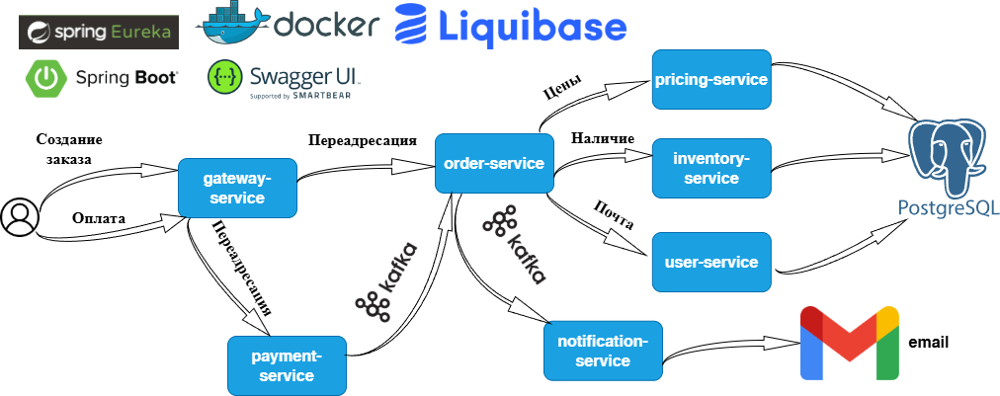

# 🛒 Marketplace Microservices


---

## 🛠️ Технологический стек

| Категория          | Технологии                                                                                                   |
|--------------------|--------------------------------------------------------------------------------------------------------------|
| **Backend**        | Java 17, Spring Boot 3, Spring Cloud (Gateway, Eureka, OpenFeign), Spring Data (JPA, Redis), ORM (Hibernate) |
| **Базы данных**    | PostgreSQL, Liquibase, Redis                                                                                 |
| **Тестирование**   | JUnit 5, Mockito                                                                                             |
| **Инфраструктура** | Docker,  Kafka, Zookeeper, Service Discovery (Eureka), Swagger API                                           |
| **Инструменты**    | Lombok, SLF4J, PMD, Checkstyle, JaCoCo                                                                       |

---

## 📦 Микросервисы

| Сервис                   | Описание                                       |
|--------------------------|------------------------------------------------|
| **order-service**        | Управление заказами (создание, отмена, статус) |
| **inventory-service**    | Резервация и списание товаров со склада        |
| **user-service**         | Управление пользователями                      |
| **pricing-service**      | Расчет цен и скидок на товары                  |
| **payment-service**      | Обработка платежей                             |
| **notification-service** | Отправка email                                 |
| **gateway-service**      | Единая точка входа (API Gateway)               |
| **eureka-service**       | Service Discovery (централизованный реестр)    |

---

## 🏗️ Архитектура


---

## 📅 Планы развития

- JWT аутентификация
- Покрытие unit и integration тестами

---

## 🚀 Полный запуск

```bash
docker-compose up -d --build
```

## 🚪 Доступ к сервисам

`API Gateway` → http://localhost:8085/api/...  
`Swagger UI` →  http://localhost:8085/swagger-ui.html   
`Eureka Dashboard` → http://localhost:8761

> **Swagger UI** — единая документация для всех API микросервисов.  
> Доступные спецификации:
> - `Inventory API` → `/inventory/v3/api-docs`
> - `Payment API` → `/payment/v3/api-docs`
> - `Pricing API` → `/pricing/v3/api-docs`
> - `Order API` → `/order/v3/api-docs`
> - `User API` → `/user/v3/api-docs`

## 🧩 Использованные паттерны проектирования

### Структурные паттерны

| Паттерн       | Применение                                            | Примеры в проекте                              |
|---------------|-------------------------------------------------------|------------------------------------------------|
| **Фасад**     | Упрощение сложных взаимодействий между микросервисами | `OrderService` как фасад для работы с заказами |
| **Стратегия** | Гибкая система обработки различных типов уведомлений  | `EmailStrategy` и его реализации               |

### Порождающие паттерны

| Паттерн       | Применение                            | Примеры в проекте                         |
|---------------|---------------------------------------|-------------------------------------------|
| **Строитель** | Постепенное создание сложных объектов | `Order.builder()`, `OrderEvent.builder()` |

### Архитектурные паттерны

| Паттерн             | Применение                                                         |
|---------------------|--------------------------------------------------------------------|
| **Event-Driven**    | Асинхронная обработка событий через Kafka                          |
| **Repository**      | Абстракция доступа к данным                                        |

